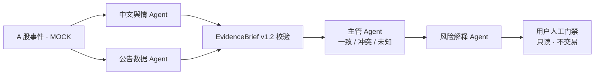
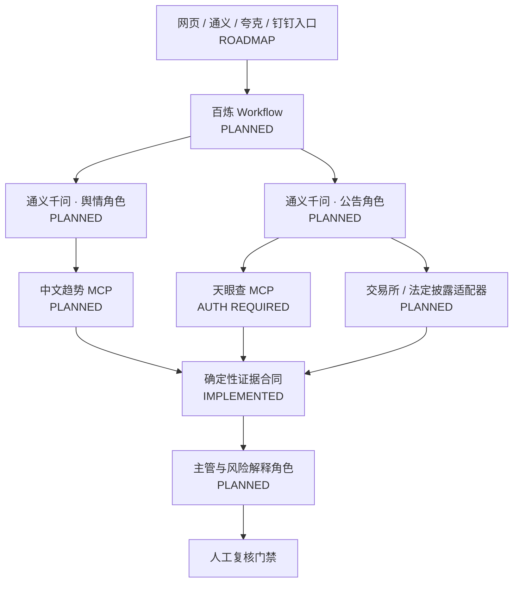

<div align="center">

# OrgLab Sentinel

### A 股多源证据核验与风险解释原型

舆情 Agent 与公告 Agent 分头取证，主管保留一致、冲突和未知项，风险解释 Agent 只负责解释；最终决定始终交还给用户。

[](https://github.com/mungbean138516-jpg/orglab-sentinel/actions/workflows/ci.yml)


[在线演示](https://mungbean138516-jpg.github.io/orglab-sentinel/) · [90 秒演示脚本](docs/roadshow/07_DEMO_SCRIPT.md) · [路演资料包](docs/roadshow/README.md) · [架构说明](docs/roadshow/01_SYSTEM_ARCHITECTURE.md)

</div>

> [!IMPORTANT]
> **仅为概念验证，落地需相应资质与合规评估。** 当前版本只使用虚构 A 股证券与固定 MOCK 数据，不接真实账户、不连接券商、不荐股、不预测收益，也不自动执行交易。

## 一句话定位

OrgLab Sentinel 不是“AI 炒股软件”，而是一套可复用的**多源证据交接与风险解释引擎**。A 股只是首个验证场景：它帮助用户看清哪些是官方事实、哪些只是舆情推断、哪些仍然未知，从而减少由信息缺口和情绪共振造成的重大误判。

## 当前能演示什么

- 三个完全虚构的 A 股固定场景：业绩预告修正、交易所问询、供应链传闻；
- 舆情与公告两个专项 Agent 的逻辑并行；
- `EvidenceBrief v1.2`、`SupervisorSynthesis v1.2` 与 `UserRiskReport v1.2` 的运行时 AJV 校验；
- 证据 ID、来源等级、时效、同源去重、冲突和未知项的完整引用链；
- 右侧完整报告抽屉与“只记录已阅读”的人工门禁；
- 趋势阈值图、模拟关注权重图与已确认／待核实／暂无法判断构成；
- 趋势源超时、公告过期、同源转载、证据冲突、合同失败等安全降级；
- 固定输入下对比扁平群聊、主管—专家、动态风控三种组织。

## 状态必须这样读

| 状态 | 含义 | 本项目中的例子 |
| --- | --- | --- |
| `IMPLEMENTED` | 仓库中真实存在的代码能力 | 运行时 JSON Schema 校验、Patch 账本、人工门禁 |
| `MOCK ACTIVE` | 可运行，但输入全部是固定虚构数据 | A 股事件、公告、热搜与图表 |
| `PLANNED` | 已完成概念设计，尚未真实调用 | 百炼、通义千问、ModelScope / EvalScope |
| `AUTH REQUIRED` | 可选外部工具，需要服务端授权 | 天眼查 MCP |
| `ROADMAP` | 后续产品方向 | 钉钉人工复核、通义／夸克用户入口 |

页面不会把 `PLANNED` 冒充成“已连接”或“实时”。

## 核心工作流



| 岗位 | 只负责什么 | 明确不能做什么 |
| --- | --- | --- |
| 中文舆情 Agent | 发现新闻、热搜和公开讨论；分级、去重、隔离传闻 | 不能把热度当事实，不能形成交易建议 |
| 公告数据 Agent | 核对交易所公告、财务字段和企业主体信息 | 不能输出目标价或仓位 |
| 主管 Agent | 比较两份简报，保留一致、冲突和未知项 | 不能创造新事实或静默抹平冲突 |
| 风险解释 Agent | 翻译证据状态和用户核验清单 | 不能荐股、连接券商或自动下单 |

当前这些 Agent 是**同一 React 浏览器应用里的逻辑角色**，由确定性 JavaScript 状态机驱动；并不是四个已经部署的平台或四个真实大模型。

## 阿里目标架构



最简洁的技术表达：

> 千问负责分析，百炼负责组织，MCP 负责连接；魔搭及 EvalScope 提供开源资源与评测支持，钉钉把决定交还给人。

MCP 是工具连接协议，不是 Agent，也不是数据真实性证书。中文趋势 MCP 只能发现线索；天眼查 MCP 用于企业事实交叉核验；最终确认仍应优先使用交易所与法定披露来源。

## 快速开始

要求 Node.js `>=22.12.0`。

```bash
git clone https://github.com/mungbean138516-jpg/orglab-sentinel.git
cd orglab-sentinel
npm ci
npm run dev
```

浏览器打开 Vite 输出的本地地址（通常是 `http://localhost:5173/`）。

### 质量检查

完整质量门禁：

```bash
npm run check
```

该命令运行合同、证据链、故障降级与组织实验测试，再生成生产构建。GitHub Actions 在 push 和 pull request 时执行同样的检查。

## 90 秒现场路径

1. 在「风险情报台」选择“业绩预告修正”，点击运行固定回放。
2. 指出两位专项 Agent 逻辑并行，并分别提交 `EvidenceBrief v1.2`。
3. 展开趋势阈值图：越过阈值只触发核验，不预测股价。
4. 点击“查看证据与完整报告”，展示事实、冲突、未知项和引用 ID。
5. 点击“我已阅读风险提示”，强调它不会触发交易。
6. 去「组织实验」注入“公告与舆情冲突”或“输出合同失败”，展示系统安全降级。
7. 去「目标架构」，用一页解释百炼、千问、魔搭、MCP 与钉钉各自的职责。

完整逐句旁白、录屏时间轴与故障备选见 [Demo 脚本](docs/roadshow/07_DEMO_SCRIPT.md)。

## 目录

```text
src/
  App.jsx                     # 四个可点击页面与交互状态
  components/RiskVisuals.jsx  # 关注权重、阈值和证据构成图
  data/demoData.js            # A 股虚构 fixture、Agent 与连接状态
  lib/contracts.js            # AJV 运行时合同校验与跨合同引用检查
  lib/simulation.js           # 管线状态、故障、拒收降级、Patch 账本与组织实验
  styles.css                  # 响应式设计与颜色语义
test/
  simulation.test.js          # 合同、证据链、降级和实验测试
docs/
  contracts/                  # 四个 v1.2 JSON Schema
  roadshow/                   # 架构、PPT、演示、合规与接入资料
.github/
  workflows/                  # CI 与 GitHub Pages
```

## 路演与 PPT 素材

`docs/roadshow/` 已把工程真相、目标愿景和 PPT 素材分开：

- [系统架构：当前 Prototype vs 目标架构](docs/roadshow/01_SYSTEM_ARCHITECTURE.md)
- [Agent 层级与权限](docs/roadshow/02_AGENT_HIERARCHY.md)
- [端到端事件流](docs/roadshow/03_END_TO_END_EVENT_FLOW.md)
- [合同与安全边界](docs/roadshow/04_CONTRACTS_AND_SAFETY.md)
- [阿里技术图谱](docs/roadshow/05_ALIBABA_TECHNOLOGY_MAP.md)
- [A 股适配层](docs/roadshow/06_A_SHARE_ADAPTER_LAYER.md)
- [90 秒 Demo 脚本](docs/roadshow/07_DEMO_SCRIPT.md)
- [宣传与合规矩阵](docs/roadshow/08_CLAIMS_AND_COMPLIANCE_MATRIX.md)
- [团队反馈决策日志](docs/roadshow/09_STAKEHOLDER_FEEDBACK_DECISIONS.md)
- [11 页 PPT 素材映射](docs/roadshow/10_PPT_SOURCE_MAP.md)
- [连接器、依赖与密钥安全](docs/roadshow/11_CONNECTOR_SETUP_AND_SECRETS.md)

## 密钥与真实接入

仓库只保存 `.env.example` 占位符，绝不保存真实：

- `DASHSCOPE_API_KEY`
- `MODELSCOPE_ACCESS_TOKEN`
- `TIANYANCHA_API_KEY`
- ModelScope Hosted MCP Remote URL

任何真实接入都必须走：

```text
浏览器 → 自有后端 / 百炼 → MCP 或数据服务
```

密钥不能使用 `VITE_*` 暴露到前端，也不能出现在 Git、截图、录屏、日志或 PPT 中。完整规则见 [连接器与密钥](docs/roadshow/11_CONNECTOR_SETUP_AND_SECRETS.md)。

## 协作

`main` 保持为可运行基线。团队成员无需先拆八个 Issue；从最新 `main` 创建聚焦分支，尽早开 Draft PR：

```bash
git switch main
git pull --ff-only
git switch -c frontend/improve-report-drawer
npm run check
```

跨模块修改时优先避免多人同时重写 `App.jsx`、`styles.css` 或共享 Schema。UI 变化附截图或录屏；合同、风险文案、实验指标与外部连接器需交叉审阅。

## 最后边界

这是一套可路演的前端概念原型，不是生产金融系统。它尚未实现真实行情、公告或热搜接入，未真实调用百炼、千问、魔搭、天眼查 MCP、趋势 MCP 或钉钉，也没有后台权限、持久化数据库、身份系统、券商连接或交易能力。
