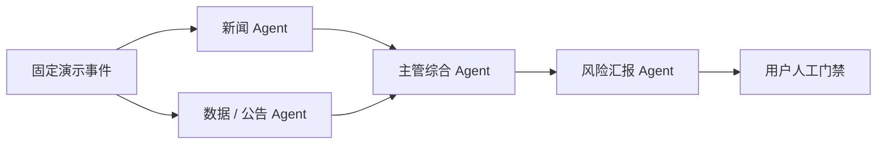

# OrgLab Sentinel

**OrgLab Sentinel** 是一个面向个人投资者的多智能体持仓风险预警与组织实验原型。它研究的重点不是“让更多 Agent 一起聊天”，而是：不同来源应由谁负责、证据如何交接、冲突如何保留，以及哪种组织在同一故障下更可靠。

> 当前版本只使用固定模拟数据，不接真实账户、不连接券商、不自动交易，也不构成投资建议。

## 这版实现了什么

- 新闻 Agent 与数据/公告 Agent **并行**处理不同来源；
- 两个专项 Agent 输出统一的 `EvidenceBrief v1` 结构化简报；
- 主管 Agent 只合并证据、一致点、冲突与未知项，不创造新事实；
- 风险 Agent 将综合结果映射到虚构持仓，生成用户风险报告；
- 所有重要状态通过带引用关系的 Patch 进入决策账本；
- 最终只允许用户“标记为已阅读”，系统没有下单能力；
- 可对同一事件注入 Agent 超时或证据冲突，比较三种组织模式；
- 三个离线可点击页面：风险监控台、Agent 团队、组织实验室。



## 快速运行

要求 Node.js `>=22.12.0`。

```bash
npm ci
npm run dev
```

浏览器打开 Vite 输出的本地地址。局域网演示时才使用：

```bash
npm run dev:host
```

验证全部核心逻辑和生产构建：

```bash
npm run check
```

## 三分钟 Demo 路径

1. 在「监控台」注入“财报指标承压”，观察新闻与数据 Agent 并行提交简报。
2. 打开两份简报，展示来源分级、结构化 findings、证据 ID 和未知项。
3. 打开 Patch 账本，说明下游只能引用上游 Patch，不能静默覆盖。
4. 打开风险报告，强调“标记已阅读”不会执行交易。
5. 切换到“未证实传闻”，展示匿名来源被隔离且不产生调仓动作。
6. 在「组织实验室」注入“新闻 Agent 超时”，运行三种组织的固定对照。

## 固定演示范围

| 维度 | 当前内容 |
| --- | --- |
| 虚构持仓 | NVDA、AAPL、TSLA |
| 场景 | 财报指标承压、供应链中断、未证实传闻 |
| Agent | 新闻、数据/公告、主管综合、风险汇报 |
| 组织 | 扁平群聊、主管—专家、动态风控 |
| 故障 | 无故障、新闻 Agent 超时、证据冲突 |
| 数据模式 | `MOCK`；本地 fixture；无实时 feed |

实验页的分数由固定输入与固定公式确定，只用于展示 OrgLab 的测量方法。页面明确标记 `n=1 demo replay`；它不是统计显著性或真实投资表现。

## 目录

```text
src/
  App.jsx                 # 三个页面和交互状态
  data/demoData.js        # 固定持仓、场景、Agent 与证据 fixtures
  lib/simulation.js       # 管线状态、Patch 账本与组织实验计算
  styles.css              # 响应式设计系统
test/
  simulation.test.js      # 并行分工、隔离、降级、证据链与实验测试
docs/
  DATA_INTEGRATION.md     # SEC/Finnhub 的安全接入边界
  contracts/              # 版本化结构化输出合同
.github/
  workflows/ci.yml        # test + build
  ISSUE_TEMPLATE/         # 8 人认领任务模板
```

## 真实数据路线

路演永远保留本地 fixture。下一阶段再从后端加入：

1. SEC EDGAR：10-K、10-Q、8-K、Submissions 与 XBRL facts；
2. Finnhub：仅作为公司新闻的二级触发源；
3. 统一 `Event` → `EvidenceBrief` → `SupervisorSynthesis` → `UserRiskReport` 合同；
4. 任何 live 失败必须显式降级，不能用虚构信息冒充实时结果。

SEC 浏览器 CORS、声明式 User-Agent、限流/缓存，以及 Finnhub 服务端密钥要求见 [数据接入边界](docs/DATA_INTEGRATION.md)。密钥禁止使用 `VITE_*` 前缀，也禁止进入浏览器代码或 Git。

## 8 人协作

- 先在 GitHub Issue 中用 `/claim` 认领一个可验收结果；
- 分支使用 `role/issue-number-short-name`；
- 尽早开 Draft PR，避免多人同时大改 `App.jsx` 或结构化合同；
- PR 必须附 `npm test`、`npm run build` 结果；UI 变化附截图；
- schema、风险文案、实验指标和数据适配器需要对应角色交叉审阅。

具体角色、第一批任务与验收条件见 [TEAM_TASKS.md](TEAM_TASKS.md)，开发规范见 [CONTRIBUTING.md](CONTRIBUTING.md)，安全边界见 [SECURITY.md](SECURITY.md)。

## 当前边界

这仍是可路演的前端研究原型，不是生产级金融系统。尚未实现真实 API、后台权限强制、持久化事件存储、LLM 调用、通知服务、身份系统或券商集成。页面中的金额、收益、风险分、响应时间和证据均为固定演示值。

