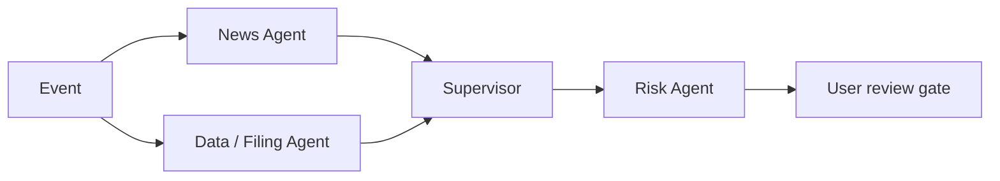

<div align="center">

# OrgLab Sentinel

### Source-specialist multi-agent risk intelligence lab

让新闻、公告与财务数据各归其位，再由主管 Agent 保留证据、冲突与未知项，最终把风险交还给用户判断。

[](https://github.com/mungbean138516-jpg/orglab-sentinel/actions/workflows/ci.yml)


[快速开始](#快速开始) · [三分钟演示](#三分钟-demo) · [架构与合同](#架构与合同) · [真实数据路线](#真实数据路线) · [协作开发](#协作开发)

</div>

> [!IMPORTANT]
> 当前版本只使用固定模拟数据，不接真实账户、不连接券商、不自动交易，也不构成投资建议。

## 项目解决什么问题

多数多 Agent 演示让所有 Agent 同时讨论同一份信息，结果很难判断事实来自哪里、谁覆盖了谁、冲突为何消失。OrgLab Sentinel 把信息源责任和交接合同放在产品核心：

- **新闻 Agent** 负责时效性公开报道；
- **数据 / 公告 Agent** 独立负责 SEC 文件和结构化财务数据；
- **主管 Agent** 只综合带引用的结构化简报，不创造新事实；
- **风险 Agent** 把综合结果映射到虚构持仓，向用户说明风险与不确定性；
- **用户人工门禁** 只能记录“已阅读”，永远不会下单。

## 核心工作流



| 阶段 | 专项职责 | 标准输出 | 安全降级 |
| --- | --- | --- | --- |
| News Agent | 公司新闻、公开报道、时效线索 | `EvidenceBrief v1` | 超时会显式标记，不抹除数据简报 |
| Data / Filing Agent | SEC 文件、XBRL 与结构化数据 | `EvidenceBrief v1` | 缺失字段进入 gaps，不补造数值 |
| Supervisor | 一致点、冲突、未知项与证据覆盖 | `SupervisorSynthesis v1` | 冲突保留并隔离，不强行给单一结论 |
| Risk Agent | 虚构持仓暴露与用户可读风险 | `UserRiskReport v1` | 证据不足时暂不估计影响或风险分 |

## 已实现能力

- 新闻与数据两个专项 Agent **并行**处理不同来源；
- 版本化 JSON Schema 和 Ajv 测试约束四个核心合同；
- evidence ID、source class、locator、as-of、gap、conflict 全链路可追踪；
- Patch 决策账本保留从事件到用户复核的父子关系；
- 未证实传闻会被隔离，不能转化成调仓动作；
- 可注入新闻 Agent 超时和证据冲突，观察风险如何向下游传播；
- 可用同一输入与固定预算比较三种 Agent 组织；
- 三个离线可点击页面：风险监控台、Agent 团队、组织实验室；
- 无 API key、无实时 provider 请求、无账户或交易能力。

## 快速开始

要求 Node.js `>=22.12.0`。

```bash
git clone https://github.com/mungbean138516-jpg/orglab-sentinel.git
cd orglab-sentinel
npm ci
npm run dev
```

浏览器打开 Vite 输出的本地地址。运行完整质量门禁：

```bash
npm run check
```

该命令会运行 11 项核心测试并生成生产构建。CI 在每次 push 和 pull request 时执行同样的检查。

## 三分钟 Demo

1. 在「监控台」注入“财报指标承压”，观察新闻与数据 Agent 并行提交简报。
2. 打开两份简报，展示来源分级、结构化 findings、证据 ID 和未知项。
3. 打开 Patch 账本，说明下游只能引用上游 Patch，不能静默覆盖。
4. 打开风险报告，强调“标记已阅读”不会执行交易。
5. 切换到“未证实传闻”，展示匿名来源被隔离且不产生调仓动作。
6. 在「组织实验室」注入“新闻 Agent 超时”，运行三种组织的固定对照。

## 组织实验

| 维度 | 当前固定演示范围 |
| --- | --- |
| 虚构持仓 | NVDA、AAPL、TSLA |
| 场景 | 财报指标承压、供应链中断、未证实传闻 |
| 组织 | 扁平群聊、主管—专家、动态风控 |
| 故障 | 无故障、新闻 Agent 超时、证据冲突 |
| 预算 | 每轮上限 `$0.50` 的固定演示约束 |
| 数据模式 | `MOCK`；本地 fixture；无实时 feed |

实验结果由固定输入与固定公式确定，只用于展示 OrgLab 的测量方法。页面明确标记 `n=1 demo replay`；它不是统计显著性或真实投资表现。

## 架构与合同

```text
src/
  App.jsx                 # 三个页面与交互状态
  data/demoData.js        # 固定持仓、事件、Agent 与证据 fixtures
  lib/simulation.js       # 管线状态、Patch 账本与组织实验计算
  styles.css              # 响应式设计系统
test/
  simulation.test.js      # 并行分工、隔离、降级、证据链与实验测试
docs/
  ARCHITECTURE.md         # 责任边界与事件时序
  DATA_INTEGRATION.md     # SEC / Finnhub 安全接入边界
  contracts/              # 四个版本化 JSON Schema
.github/
  workflows/ci.yml        # test + build
```

进一步阅读：[系统架构](docs/ARCHITECTURE.md) · [数据接入边界](docs/DATA_INTEGRATION.md) · [开发规范](CONTRIBUTING.md) · [安全边界](SECURITY.md)

## 真实数据路线

路演始终保留本地 fixture。下一阶段才从后端加入：

1. SEC EDGAR：10-K、10-Q、8-K、Submissions 与 XBRL facts；
2. Finnhub：只作为公司新闻的二级触发源；
3. 所有 provider 输出映射到同一版本化合同；
4. 任何 live 失败必须显式降级，不能用虚构信息冒充实时结果。

SEC 的声明式 User-Agent、限流与缓存，以及 Finnhub 的服务端密钥要求见 [数据接入边界](docs/DATA_INTEGRATION.md)。密钥禁止使用 `VITE_*` 前缀，也禁止进入浏览器代码或 Git。

## 协作开发

`main` 是可运行的完整基线，不要求先建立 Issue。团队成员可以直接从最新 `main` 开一个聚焦分支：

```bash
git switch main
git pull --ff-only
git switch -c frontend/improve-evidence-drawer
```

- 小范围修改按团队约定提交；跨模块修改尽早开 Draft PR；
- 避免多人同时大改 `App.jsx`、`styles.css` 或共享 schema；
- PR 附上 `npm run check` 结果，UI 变化附截图或录屏；
- schema、风险文案、实验指标和数据适配器需要对应角色交叉审阅。

角色边界与后续方向见 [TEAM_TASKS.md](TEAM_TASKS.md)，具体规范见 [CONTRIBUTING.md](CONTRIBUTING.md)。

## 当前边界

这仍是可路演的前端研究原型，不是生产级金融系统。尚未实现真实 API、后台权限强制、持久化事件存储、LLM 调用、通知服务、身份系统或券商集成。页面中的金额、收益、风险分、响应时间和证据均为固定演示值。
