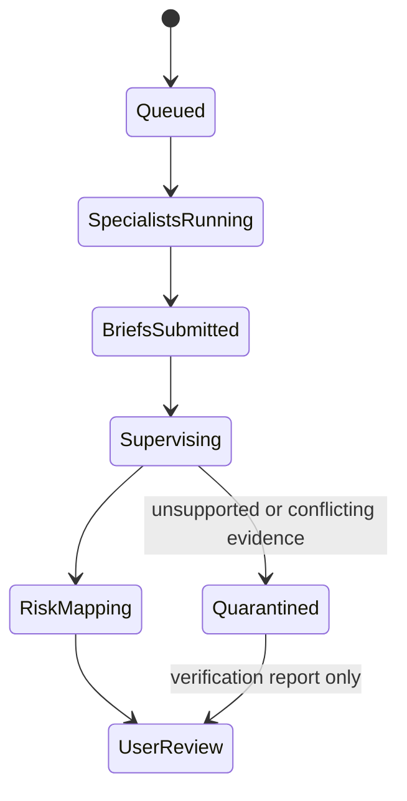

# Architecture

## Product invariant

Different source classes belong to different specialist Agents. Specialists create evidence; the Supervisor reconciles evidence; the Risk Agent maps the synthesis to a portfolio scenario; the user remains the only decision-maker.

## Deterministic prototype state machine



The News and Data/Filing specialists share a stage but not a source namespace. The Supervisor cannot begin until both have submitted a brief or a visible degraded-source state exists.

## Write boundaries

| Role | May write | May not do |
| --- | --- | --- |
| News Agent | `/sources/news/*`, `/briefs/news/*` | Modify filings, holdings, or final advice |
| Data/Filing Agent | `/sources/filings/*`, `/briefs/data/*` | Interpret social intent or form final advice |
| Supervisor | `/synthesis/*`, `/conflicts/*` | Fetch new evidence or erase disagreement |
| Risk Agent | `/reports/risk/*`, `/governance/review/*` | Connect a broker or execute an order |

These are visual/contractual boundaries in V0.2. A production backend must enforce them as capabilities; UI labels alone are not authorization.

## Patch lineage

Each scenario generates four ordered Patch records:

1. News brief Patch cites news evidence IDs.
2. Data brief Patch cites filing/data evidence IDs.
3. Supervisor Patch cites both specialist Patch IDs.
4. User risk report Patch cites the Supervisor Patch and sets `human_gate: REQUIRED`.

The in-browser ledger is deterministic display state, not a cryptographically immutable log. Future persistence should use an append-only server log with identity, authorization, timestamps, content hashes, schema versions, and checkpoints.

## Organization experiment

The prototype fixes the event, fixture, budget, rule version, and seed, then varies one organization mode. Its illustrative score is:

```text
score = 0.30 quality
      + 0.30 reliability
      + 0.18 recovery
      + 0.08 latency_score
      + 0.07 cost_score
      + 0.07 duplicate_work_score
```

This is a product-demo formula, not a validated scientific metric. A research result requires repeated seeds, locked model/prompt/tool versions, a documented task set, uncertainty intervals, and preregistered metric definitions.

