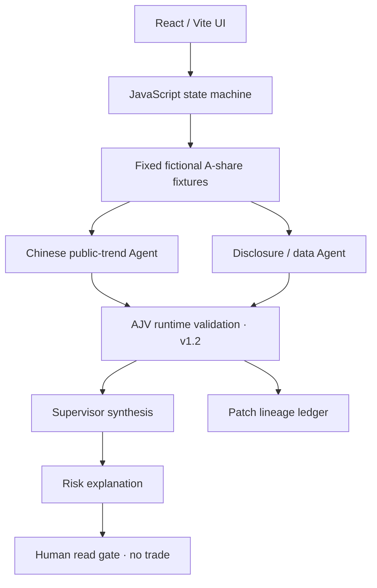
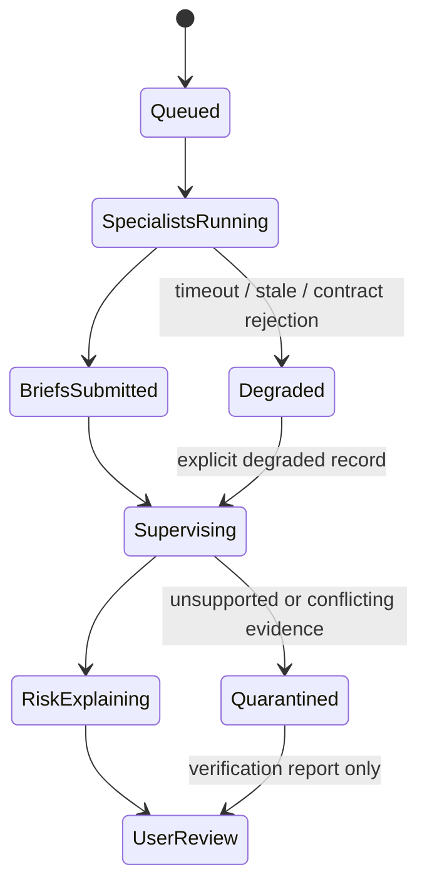
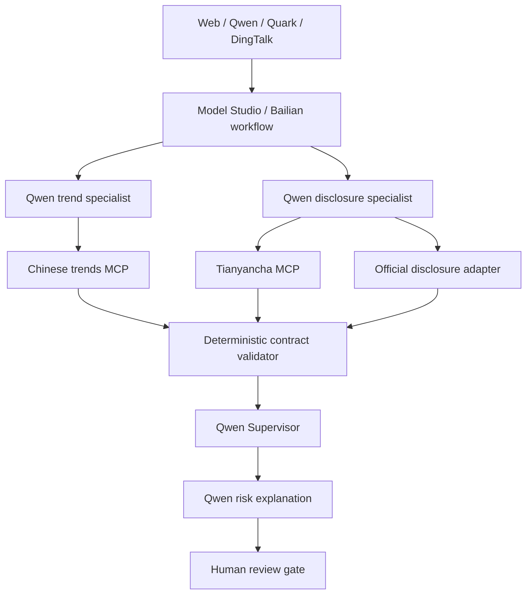

# Architecture

> Status: **IMPLEMENTED · MOCK** for the browser prototype. Alibaba Cloud and external MCP capabilities are **PLANNED / NOT CONNECTED**.

## Product invariant

Different source classes belong to different specialist Agents. Specialists create evidence; the Supervisor reconciles it; the Risk Explanation Agent explains it; the user remains the only decision-maker.

The system never turns heat, repetition, missing data, or model confidence into a buy/sell instruction.

## Current deterministic prototype



“Parallel” currently means both specialist roles share the same pipeline phase and submit independent artifacts. It is a logical browser simulation, not concurrent cloud model calls.

## State machine



## Write boundaries

| Role | May write | May not do |
| --- | --- | --- |
| Chinese public-trend Agent | `/sources/trends/*`, `/briefs/news/*` | Treat heat as fact, modify disclosures, recommend a trade |
| Disclosure / data Agent | `/sources/disclosures/*`, `/briefs/data/*` | Interpret social intent, output target price or position |
| Supervisor | `/synthesis/*`, `/conflicts/*` | Fetch new evidence, invent facts, erase disagreement |
| Risk Explanation Agent | `/reports/risk/*`, `/governance/review/*` | Connect a broker, predict returns, execute an order |

These are contractual and visual boundaries in the prototype. Production requires server-side identity and capability enforcement.

## Contract and lineage

Each run produces:

1. an A-share `Event`;
2. two independent `EvidenceBrief v1.2` records with claim-level states and evidence references;
3. one `SupervisorSynthesis v1.2` that retains all confirmed, pending and unknown claim IDs;
4. one `UserRiskReport v1.2` with source lineage and fact-state counts;
5. ordered Patch records linking every downstream result to its parent evidence.

The browser ledger is deterministic display state, not a blockchain or cryptographically immutable log. Production persistence would require append-only storage, identity, authorization, timestamps, hashes and checkpoints.

## Fault model

The fixed replay supports:

- trend source timeout;
- stale disclosure data;
- duplicate / same-origin posts;
- disclosure versus public-trend conflict;
- runtime EvidenceBrief rejection followed by a schema-valid degraded record.

Every fault leaves a visible state and still produces a safe, non-execution report.

## Target Alibaba architecture



Target does not mean connected. See [`docs/roadshow/01_SYSTEM_ARCHITECTURE.md`](roadshow/01_SYSTEM_ARCHITECTURE.md) and [`05_ALIBABA_TECHNOLOGY_MAP.md`](roadshow/05_ALIBABA_TECHNOLOGY_MAP.md).

## Organization experiment

The prototype fixes event, fixture, budget, rule version and seed, then varies organization mode. Its illustrative formula is shown in the UI:

```text
score = 0.24 official_evidence_coverage
      + 0.24 conflict_retention
      + 0.20 unknown_visibility
      + 0.16 recovery
      + 0.06 latency_score
      + 0.04 cost_score
      + 0.06 duplicate_work_score
```

This is a product-demo formula, not a validated research or financial metric. Research claims require repeated seeds, locked model/tool versions, documented tasks and uncertainty intervals.
