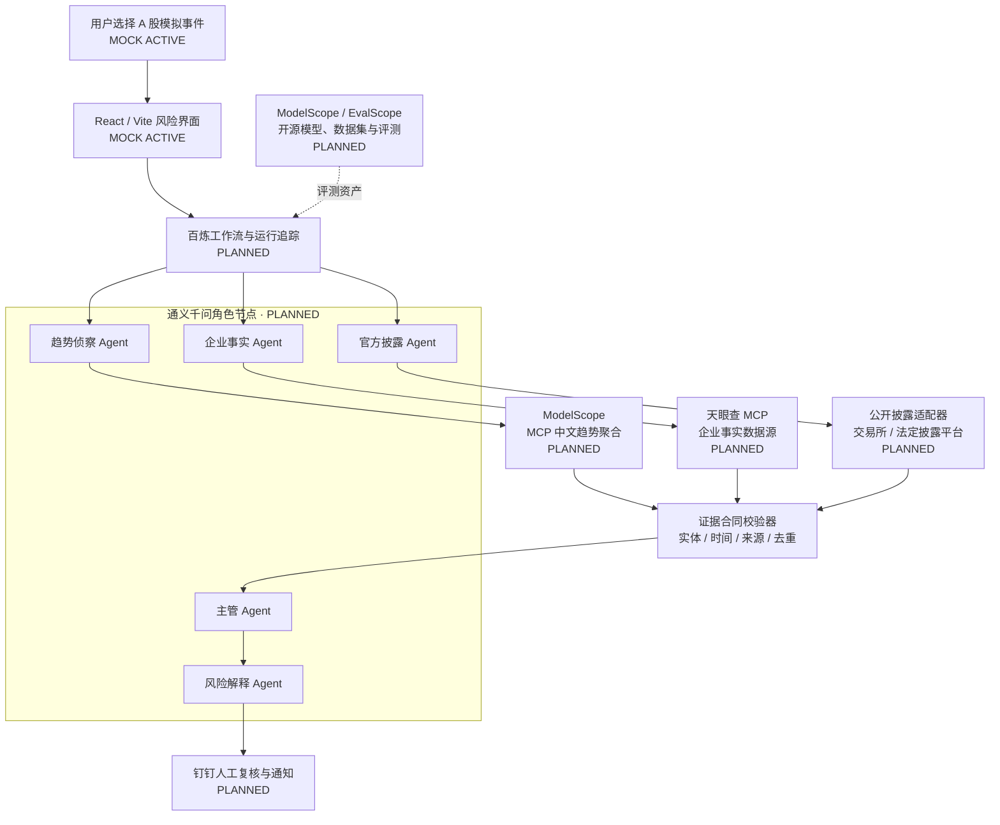

# 阿里技术版图与路演口径

> 文档状态：`ROADSHOW MATERIAL`  
> 当前实现：`MOCK ACTIVE`  
> 目标架构：`PLANNED`  
> 合规声明：**仅为概念验证，落地需相应资质与合规评估。**

## 1. 先讲清楚三个状态

| 标签 | 含义 | 路演中可以怎么说 |
| --- | --- | --- |
| `MOCK ACTIVE` | GitHub 原型里已经能实际点击或重放 | “当前原型已经验证了这段流程。” |
| `PLANNED` | 已有明确接入方案，但尚未真实调用 | “下一阶段计划通过百炼接入。” |
| `LIVE` | 已真实调用并保留调用时间、工具名和追踪记录 | 只有完成端到端验证后才能使用 |

未真实调用的服务不得显示“已连接”“实时接入”或绿色成功状态。目标架构可以做得完整，但必须标注 `PLANNED / 概念架构`。

## 2. 一句话技术定位

**百炼负责调度，通义千问负责各岗位的分析，MCP 负责连接外部数据，魔搭及 EvalScope 提供开源资源与评测支持，钉钉负责最终人工确认。**

MCP 是大模型连接工具的标准协议，不是 Agent，也不是数据真实性证书。一个 MCP 服务能够被调用，不等于其数据已经通过金融合规或事实准确性认证。

## 3. 当前原型与目标阿里架构

### 当前与目标的边界

| 能力 | 当前 GitHub 原型 | 目标概念架构 |
| --- | --- | --- |
| 界面 | React / Vite 本地运行 | Web 或无影演示环境 |
| 数据 | 固定 MOCK 案例 | 经授权的企业事实、趋势线索和官方披露适配器 |
| 多 Agent | JavaScript 状态机模拟岗位交接 | 百炼并行分支与通义千问角色节点 |
| 证据合同 | 本地固定对象和 Schema | 服务端合同校验、权限与运行追踪 |
| 异常处理 | 固定超时、冲突、传闻案例 | 超时、额度、实体歧义、来源冲突的真实降级 |
| 人工门禁 | 浏览器“已阅读” | 钉钉复核或业务系统审批 |
| 评测 | 固定重放和自动化测试 | ModelScope / EvalScope 测试集与多次重复评测 |

## 4. 每项阿里能力为什么存在

### 通义千问：岗位能力

- 同一个模型可在不同系统提示词、工具权限和输出合同下承担多个逻辑 Agent。
- 趋势 Agent 只发现线索，企业事实 Agent 只查企业数据，主管只综合已有证据。
- 不需要宣称“训练了四个金融大模型”。

### 百炼：组织与编排

- 并行启动来源专项 Agent。
- 管理超时、重试、降级和运行追踪。
- 将官方或自定义 MCP 接入智能体、工作流或 API 调用。
- 负责流程，不替代数据服务商，也不自动证明数据可信。

### ModelScope / EvalScope：开源资源与评测支持

- ModelScope 可提供开源模型、数据集和开发资源。
- EvalScope 可保存固定测试集和重复评测配置，用于验证幻觉、冲突保留和故障降级。
- ModelScope 不是天眼查、微博、知乎或交易所数据的所有者。

### 钉钉：人工门禁

- 风险报告通知。
- 团队复核、留痕和人工确认。
- 不连接券商，不下达交易指令。

### 无影 / QoderWork：开发和演示支持

- 可以作为开发、协作或演示环境。
- 它们不是项目创新点，不必为了凑数量放在主流程中心。

## 5. 两个 MCP 在架构中的真实位置

### 天眼查 MCP

定位为**企业事实数据源**：

- 企业主体识别；
- 工商登记、股权与集团关系；
- 司法、执行、处罚和经营风险；
- 知识产权、经营公示和董监高关联。

它不等于实时行情，也不能取代交易所公告。天眼查官方接入指南说明其 MCP 需要 API Key，并使用 `Authorization` 接入。

### MCP 中文趋势聚合

定位为**舆情线索发现工具**：

- 聚合多个中文互联网平台的热榜或热点；
- 返回标题、排名、链接、平台和采集时间；
- 发现“正在被讨论什么”。

该服务是 `@baranwang` 维护的社区开源 npm 包，而不是微博、知乎、Bilibili 或媒体平台的官方数据接口。MIT License 只覆盖程序代码，不自动授予第三方内容的商业使用权。

## 6. 领导版解释

> 我们没有把多个 Agent 做成一个自由群聊，而是按真实组织划分职责。趋势 MCP 负责发现舆情线索，天眼查 MCP 负责核验企业主体和经营、司法事实，官方披露 Agent 负责最终确认。百炼并行调度三条来源链，通义千问按岗位分析，所有结果先经过统一证据合同和冲突检查，再进入风险报告；任何单一来源缺失或冲突，系统都会降级，而不是补写一个看似确定的答案。

## 7. 可以说与不能说

### 可以说

- 当前已经完成可点击的 MOCK Prototype。
- 已经验证来源分工、证据交接、冲突保留和安全降级。
- 百炼支持在智能体和工作流中接入官方或自定义 MCP。
- 下一阶段可将模拟节点替换为通义千问角色和 MCP 数据适配器。
- 股票风险只是第一个验证场景，证据核验机制可复用于企业风控、供应链和舆情管理。

### 不能说

- 已经接入百炼、千问、天眼查或实时热搜。
- ModelScope 对 MCP 数据真实性进行了认证。
- 热搜内容可以直接证明上市公司风险。
- 已实现实时行情、投资建议或自动交易。
- 已证明某种 Agent 组织方式统计显著更优。

## 8. 官方与项目参考

- [阿里云百炼：模型上下文协议（MCP）](https://help.aliyun.com/zh/model-studio/mcp-introduction/)
- [阿里云百炼：自定义 MCP 服务](https://help.aliyun.com/zh/model-studio/custom-mcp)
- [阿里云百炼：MCP 接入 Qwen API](https://help.aliyun.com/zh/model-studio/mcp)
- [阿里云百炼：官方及第三方 MCP 服务](https://help.aliyun.com/zh/model-studio/official-and-third-party-mcp)
- [ModelScope：创建与部署 MCP 服务](https://modelscope.cn/docs/mcp/create)
- [ModelScope：MCP 部署限制](https://modelscope.cn/docs/mcp/limits)
- [ModelScope：EvalScope 快速开始](https://www.modelscope.cn/docs/model-evaluation/get-started/basic-usage)
- [天眼查 MCP 接入指南](https://ai.tianyancha.com/guide)
- [mcp-trends-hub npm 包](https://www.npmjs.com/package/mcp-trends-hub)
- [mcp-trends-hub GitHub 仓库](https://github.com/baranwang/mcp-trends-hub)
