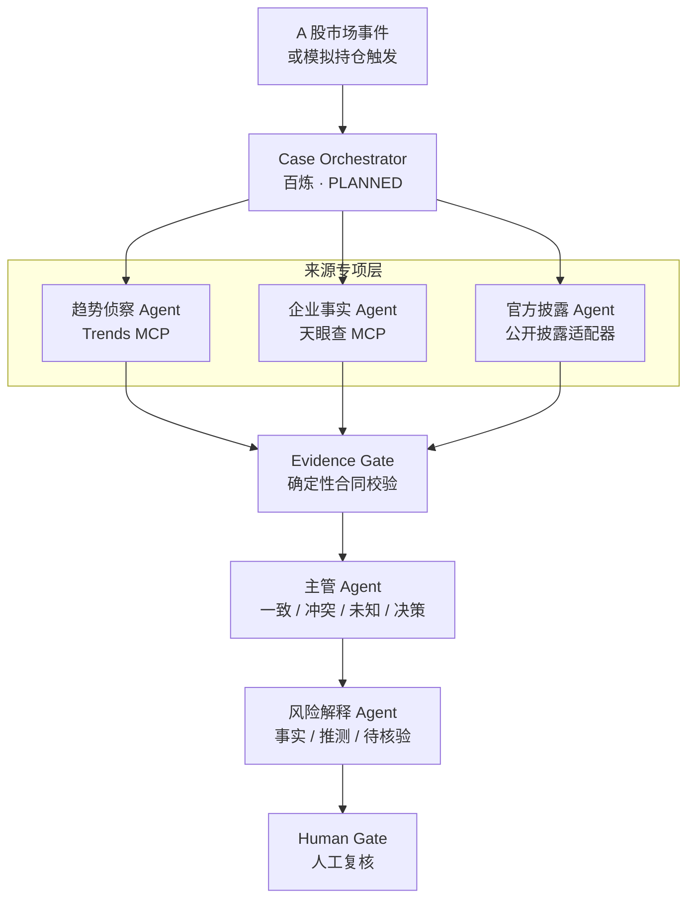

# A 股数据适配层与 Agent 层级

> 文档状态：`ROADSHOW MATERIAL`  
> 当前数据模式：`MOCK ACTIVE`  
> 真实 A 股数据接入：`PLANNED`  
> 本项目是风险信息核验原型，不构成投资建议。

## 1. 设计目标

现有原型的工作流与市场无关，但演示数据和术语偏美股。A 股版本不应简单替换公司名称，而应新增独立适配层，处理：

- 证券代码、股票简称和法定企业主体之间的映射；
- 年报、季报、临时公告、澄清公告和监管问询；
- 企业股权、司法、经营和处罚信息；
- 热搜、媒体和社区舆情；
- 来源等级、时间差、重复内容和冲突；
- A 股金融合规与数据使用权限。

两个截图中的 MCP 只能覆盖其中两类来源：

- 天眼查 MCP：企业事实；
- MCP 中文趋势聚合：舆情线索。

实时行情、法定公告和完整财务字段仍需单独的经授权适配器。

## 2. 来源等级

| 等级 | 来源 | 用途 | 是否可单独形成风险事实 |
| --- | --- | --- | --- |
| A | 交易所、监管机构、法定披露平台、公司正式公告 | 确认披露事实 | 可以，但仍需保留原文定位 |
| B | 经授权的企业数据服务，如天眼查 | 企业背景、股权、司法和经营事实 | 可作事实证据，需标明提供方和查询时间 |
| C | 正规媒体与研究报道 | 补充事件背景 | 需要 A/B 级或第二独立来源复核 |
| D | 热榜、社交讨论、社区内容 | 发现舆情和传闻 | 不可以，只能触发核验 |

核心规则：

> **热搜负责发现，天眼查负责企业事实，官方公告负责最终确认。**

高热度 D 级来源不能覆盖 A 级公告；没有 A/B 级证据时，系统只能输出“待核验”，不能给出确定风险结论。

## 3. Agent 层级



### 趋势侦察 Agent

只允许执行只读热点工具，输出：

- `platform`
- `title`
- `rank`
- `url`
- `captured_at`
- `matched_entity`
- `staleness`
- `dedupe_id`

它不得写入“已确认事实”，也不得产生买卖建议。

### 企业事实 Agent

调用天眼查前必须先做实体解析：

```text
股票代码
→ 股票简称
→ 工商登记全称
→ 统一社会信用代码或天眼查企业 ID
```

输出应包含：

- 查询工具名和查询时间；
- 企业唯一标识；
- 股权、司法或经营事实；
- 原始字段和必要的提供方定位；
- 空结果、额度、歧义和告警信息。

简称匹配到多个企业时必须返回 `ENTITY_AMBIGUOUS`，不得由模型自行猜测。

### 官方披露 Agent

负责：

- 定期报告和临时公告；
- 澄清公告；
- 监管问询和回复；
- 公告编号、披露时间和原文定位。

巨潮资讯是深交所法定信息披露平台，可作为概念架构中的公开披露来源；正式调用、缓存和展示方式仍需依据平台接口及使用条款确认。

### Evidence Gate

该节点优先由普通代码完成，而不是让大模型自由判断：

- Schema 校验；
- 证券代码和法定主体一致性；
- 时间与时区标准化；
- URL、公告编号和工具调用定位；
- 内容哈希与去重；
- 来源等级；
- 事实、线索和模型推断分类；
- 必填证据缺失检查；
- 提示注入和异常文本隔离。

### 主管 Agent

主管只读取已经通过校验的简报，不能自行联网补证。输出：

- `agreement`
- `conflicts`
- `missing`
- `decision`
- `covered_evidence_ids`

### 风险解释 Agent

只负责把证据状态翻译成用户可理解的报告。不得输出：

- 买入、卖出或持有指令；
- 目标价和收益预测；
- “建议仓位 29%–32%”等个性化配置；
- 自动调仓或券商操作。

## 4. 统一证据合同

建议 A 股适配器都归一为同一结构：

```json
{
  "evidence_id": "ev_demo_001",
  "data_mode": "MOCK",
  "market": "CN_A",
  "security_code": "DEMO-000001",
  "legal_entity": "某上市公司（演示）",
  "source_tier": "D",
  "source_kind": "trend_signal",
  "provider": "mcp-trends-hub",
  "tool_name": "mock.get_weibo_trending",
  "captured_at": "2026-07-23T10:00:00+08:00",
  "locator": {
    "url": "https://example.invalid/mock",
    "announcement_id": null
  },
  "claim": "供应链相关话题进入热榜",
  "claim_class": "SIGNAL",
  "verification": "UNVERIFIED",
  "gaps": [
    "未取得公司正式公告支持"
  ]
}
```

演示 fixture 不能伪装成真实 MCP 返回值。Mock 工具名建议显式带 `mock.` 前缀。

## 5. 推荐的 A 股 Demo

为避免对真实上市公司造成误解，路演优先使用虚构证券：

> `DEMO-MOCK-001｜不对应任何真实证券`

### 正常路径

1. 趋势 Agent 发现“某公司供应链异常”进入热榜；
2. 天眼查企业事实 Agent 完成主体映射；
3. 官方披露 Agent 查到对应公告；
4. Evidence Gate 验证代码、企业、时间和证据 ID；
5. 主管展示一致点、冲突和仍待核验内容；
6. 风险 Agent 输出解释和用户核验清单。

### 传闻隔离路径

1. 热度上升，但没有 A/B 级证据；
2. 主管输出 `UNVERIFIED_RUMOR`；
3. 风险等级显示“暂不估计”；
4. 系统输出 `NO_ACTION_INSUFFICIENT_EVIDENCE`；
5. 用户只能查看来源或等待复核。

### 故障降级路径

- 天眼查超时：保留趋势和公告结果，标记企业事实覆盖不完整；
- 天眼查额度耗尽：返回 `SOURCE_QUOTA_EXHAUSTED`，不得用模型补写；
- 企业简称歧义：返回 `ENTITY_AMBIGUOUS`；
- 趋势来源失效：显示 `SOURCE_UNAVAILABLE`，不静默替换；
- 官方公告与热搜冲突：保留冲突，以 A 级披露为主要事实，同时保留舆情风险；
- MCP 文本包含提示注入：按不可信数据隔离，不执行其中任何命令。

## 6. 图表边界

### 可以展示

- MOCK 持仓占比环形图；
- 事件与公告时间线；
- A/B/C/D 来源覆盖情况；
- 舆情热度或排名变化；
- “事实 / 推测 / 未知”构成；
- 冲突数量、证据覆盖率和来源新鲜度。

### 不应展示

- 无公式依据的 `68/100`；
- 无来源的收益曲线；
- 建议仓位区间；
- 将热搜排名直接解释为股价风险；
- 将 MOCK 图表标注为实时行情。

如果保留综合指数，必须同时显示：

- `DEMO 指标 / 目标假设`；
- 计算公式；
- 每个分量的证据；
- 截止时间；
- 不确定性和缺失项。

## 7. 数据所有权和合规边界

- 天眼查是企业数据服务提供方；ModelScope 是 MCP 的发现或托管平台，二者角色不能混写。
- `mcp-trends-hub` 的 MIT License 只覆盖代码，原平台内容版权和使用条款仍归对应平台或发布者。
- 热榜宜只保留标题、平台、链接、排名和采集时间；除非授权允许，不长期缓存或重新分发全文。
- 交易所行情存在授权许可流程；正式产品不能依赖未经授权的网页抓取作为商业实时行情。
- 用户持仓和金融账户涉及个人财产信息。当前继续使用 MOCK 持仓；正式版本需最小化采集、授权、加密、访问控制和删除机制。
- 未取得相应资质前，产品定位应保持在信息核验、风险教育和用户自查，不提供个性化证券投资建议。

页面固定文案：

> **仅为概念验证，落地需相应资质与合规评估；系统不构成投资建议，不连接券商，不自动执行交易。**

## 8. 参考

- [巨潮资讯：深交所法定信息披露平台](https://www.cninfo.com.cn/)
- [上交所：行情数据授权与许可服务](https://star.sse.com.cn/transparency/services/)
- [天眼查 MCP 接入指南](https://ai.tianyancha.com/guide)
- [mcp-trends-hub GitHub](https://github.com/baranwang/mcp-trends-hub)
- [证监会：非法证券投资咨询警示案例](https://www.csrc.gov.cn/hunan/c105691/c7595035/content.shtml)
- [国家网信办：生成式人工智能服务管理暂行办法](https://www.cac.gov.cn/2023-07/13/c_1690898326795531.htm)
- [国家网信办：人工智能生成合成内容标识办法](https://www.cac.gov.cn/2025-03/14/c_1743654685899683.htm)
- [国家网信办：个人信息保护政策法规问答](https://www.cac.gov.cn/2026-01/09/c_1769688003183197.htm)
