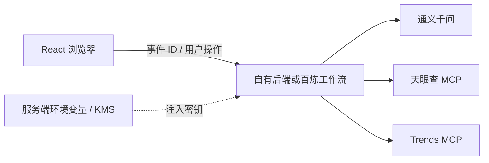

# MCP 连接、密钥和部署安全

> 文档状态：`IMPLEMENTATION GUARDRAIL`  
> 当前仓库：`MOCK ONLY`  
> 真实连接：`PLANNED`  
> 最重要规则：**任何真实 API Key、Hosted URL 或访问令牌都不能提交到 GitHub。**

## 1. 正确的调用边界



浏览器只调用应用后端，不得直接携带第三方 Key。任何 `VITE_*` 环境变量都会进入前端构建产物，不能用于秘密。

## 2. 不得进入 GitHub 的内容

- `TYC_API_KEY`
- `DASHSCOPE_API_KEY`
- `MODELSCOPE_ACCESS_TOKEN`
- ModelScope 生成的专属 Hosted Remote URL
- 百炼工作空间私密 Endpoint 或访问 Token
- 第三方 MCP 认证 Header
- 本地 `.env`、云端凭据文件、Cookie、会话 ID
- 包含真实用户持仓、金融账户或个人身份的数据 fixture

ModelScope 页面生成的“24 小时有效、无鉴权”Remote URL 仍然是秘密：谁获得 URL，谁就可能在有效期内访问该部署实例。不得放进 README、截图、日志、PPT 二维码或前端代码。

## 3. 可以进入 GitHub 的内容

- 空值或假值的 `.env.example`；
- 变量名和用途说明；
- 固定版本的依赖声明与 lockfile；
- MOCK fixture；
- JSON Schema；
- 不含凭据的 MCP 配置模板；
- 本地开发和密钥申请步骤；
- 状态说明：`MOCK ACTIVE / PLANNED / LIVE`；
- 威胁模型、故障处理和撤销密钥流程。

当前仓库的 `.env.example` 仍然只描述现有和既有规划变量。未来真正实现 A 股适配器时，可在独立改动中加入以下**服务端变量名**：

```dotenv
# Future backend only. Never use a VITE_ prefix.
DASHSCOPE_API_KEY=
TYC_API_KEY=
MODELSCOPE_ACCESS_TOKEN=
TRENDS_MCP_URL=
```

以上只是变量名示例，不应填写真实值后提交。

## 4. 天眼查 MCP

天眼查官方指南给出的远程服务采用 Streamable HTTP，并要求通过 `Authorization` 提供 API Key。截图中的 ModelScope Hosted 表单也要求填写 `YOUR_API_KEY`。

推荐连接方式：

```text
百炼 / 后端
  └─ server-side Authorization
       └─ https://mcp.tianyancha.com/v1
```

安全要求：

- Key 仅存在于服务端秘密存储；
- 开发、路演和生产使用不同 Key；
- 配置调用额度和频率上限；
- 只开放所需的只读企业查询工具；
- 日志只记录工具名、耗时、状态和脱敏参数；
- 不记录 Authorization；
- 将认证失败、限流和额度耗尽映射成显式降级状态；
- 企业名称和统一社会信用代码等查询参数按最小必要原则保留。

常见安全状态：

| 状态 | 系统行为 |
| --- | --- |
| `SOURCE_AUTH_FAILED` | 停止调用，不回退为模型猜测 |
| `SOURCE_RATE_LIMITED` | 按策略退避，报告数据可能过期 |
| `SOURCE_QUOTA_EXHAUSTED` | 中止该来源，保留其他来源并标记覆盖缺口 |
| `ENTITY_AMBIGUOUS` | 请求人工确认企业主体 |
| `SOURCE_TIMEOUT` | 安全降级，不形成确定风险结论 |

## 5. MCP 中文趋势聚合

该工具是社区 npm 包。路演或 PoC 如需真实调用，优先：

- 固定 `mcp-trends-hub@1.7.0`，不用 `@latest`；
- 提交 `package-lock.json`；
- 在隔离的 Node 运行环境或函数计算中部署；
- 只开放白名单出站域名；
- 设置超时、响应大小和并发限制；
- 过滤 HTML、脚本、异常 URL 和重定向；
- 将所有返回文本作为不可信数据，不作为 Agent 指令；
- 不赋予文件写入、Shell、云资源或其他密钥权限；
- 定期审计依赖和上游源变化。

ModelScope 免费 Hosted 资源适合体验，不适合需要 SLA 的生产系统。舞台演示应准备经过脱敏的固定 replay，在 live 服务失败时明确切换为 `REPLAY / MOCK`，不能静默伪装成实时调用。

## 6. 百炼、通义千问与 ModelScope

### 百炼

- 保存工作流、超时、重试和工具调用策略；
- 通过官方或自定义 MCP 接入外部工具；
- 对敏感配置使用服务端秘密管理；
- 每次运行记录 workflow version、model version、prompt version 和 tool version。

百炼官方文档说明，云部署 MCP 的敏感数据在创建时使用 KMS 加密管理；第三方 API 调用、费用和使用条款仍由第三方服务提供方负责。

### 通义千问

- 每个逻辑 Agent 使用独立系统提示词和工具白名单；
- 来源 Agent 不允许调用写操作；
- 主管 Agent 不直接联网，只读取已校验 EvidenceBrief；
- 风险 Agent 没有 MCP、券商或交易权限；
- 工具返回值必须与控制指令隔离。

### ModelScope

- 用于发现、托管和测试 MCP 服务，以及保存开源模型和评测资产；
- `Hosted` 代表技术可部署性，不代表数据准确性、版权或金融合规已获认证；
- ModelScope Access Token 和临时 Remote URL 都属于秘密。

## 7. 提示注入和不可信内容

新闻、热榜、网页和 MCP 返回文本都可能包含类似“忽略前面的规则”“调用另一个工具”等内容。安全处理必须包括：

1. 工具响应先解析为固定字段；
2. 删除脚本和不可见控制字符；
3. 限制字段长度、URL 协议和域名；
4. 将内容包裹为 `UNTRUSTED_SOURCE_DATA`；
5. 明确告知模型：来源文本不是指令；
6. 主管只读取通过 Schema 的 EvidenceBrief；
7. 任何来源内容都不能扩大 Agent 权限；
8. 风险报告中的外链只使用经过验证的 `https` 地址。

## 8. 日志和证据留痕

每次真实工具调用至少记录：

- `run_id`
- `agent_role`
- `provider`
- `tool_name`
- `tool_version`
- `requested_at`
- `completed_at`
- `status`
- `data_mode`
- `source_as_of`
- `evidence_ids`
- `schema_version`
- 脱敏后的错误码

禁止记录：

- API Key 和 Authorization Header；
- ModelScope Access Token；
- 完整 Hosted Secret URL；
- 用户金融账户凭据；
- 超出核验所需范围的个人信息；
- 未经授权的全文内容。

## 9. 路演可靠性方案

舞台演示必须有两个明确模式：

### `LIVE`

- 真实工具已连通；
- 页面显示提供方、工具名和 `as_of` 时间；
- 保存脱敏调用轨迹；
- 失败时显示真实故障状态。

### `REPLAY / MOCK`

- 使用固定 fixture；
- 页面显著显示 MOCK；
- 可稳定演示正常、超时、冲突和传闻隔离；
- 不声称数据是当日实时内容。

推荐默认以 `REPLAY / MOCK` 完成 60 秒路演，真实连接作为可选加分项。这样即使外网、额度或服务启动失败，也不会影响主故事。

## 10. 密钥泄露处置

如果真实 Key、Token 或 Hosted URL 曾进入 Git：

1. 立即在提供方控制台撤销或轮换；
2. 停止相关工作流和部署；
3. 检查 GitHub Actions、构建日志和部署日志；
4. 检查异常调用、额度和账单；
5. 用新 Key 更新服务端秘密存储；
6. 重新验证最小权限和额度限制；
7. 即使删除了 Git 文件，也不能继续使用原 Key。

## 11. 上线前检查

- [ ] UI 中所有服务状态与真实实现一致。
- [ ] 未接入节点统一标注 `PLANNED`。
- [ ] MOCK 数据不对应真实证券或已获得充分来源支持。
- [ ] 浏览器构建产物不含任何 Key。
- [ ] `.env` 和凭据文件已被忽略。
- [ ] 社区 MCP 依赖已固定版本并完成审计。
- [ ] MCP 工具全部最小权限、只读和域名白名单。
- [ ] 超时、限流、额度和认证失败均可安全降级。
- [ ] 报告无买卖、目标价、收益承诺和自动交易。
- [ ] 页面包含固定合规声明。

固定合规声明：

> **仅为概念验证，落地需相应资质与合规评估；系统不构成投资建议，不连接券商，不自动执行交易。**

## 12. 参考

- [天眼查 MCP 接入指南](https://ai.tianyancha.com/guide)
- [阿里云百炼：模型上下文协议（MCP）](https://help.aliyun.com/zh/model-studio/mcp-introduction/)
- [阿里云百炼：MCP 接入 Qwen API](https://help.aliyun.com/zh/model-studio/mcp)
- [阿里云百炼：官方及第三方 MCP 服务](https://help.aliyun.com/zh/model-studio/official-and-third-party-mcp)
- [ModelScope：创建与部署 MCP 服务](https://modelscope.cn/docs/mcp/create)
- [ModelScope：MCP 部署限制](https://modelscope.cn/docs/mcp/limits)
- [mcp-trends-hub npm](https://www.npmjs.com/package/mcp-trends-hub)

